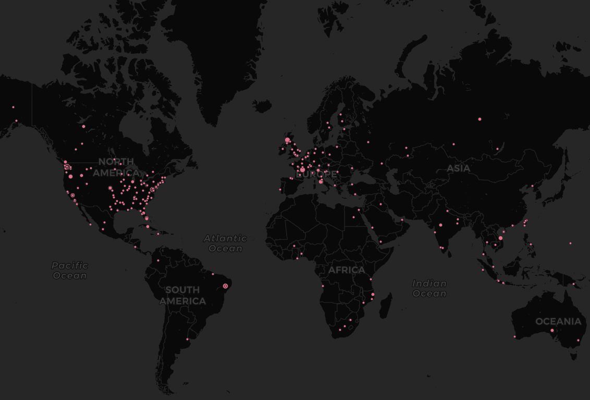

# Place context analysis using Natural Language Processing

**Author:** Jou Ho
**Contact:** jouh@uw.edu

This is a summary of place context analysis study using different analytical methods including natural language processing. In this study, contexts of two books, *Gay Seattle* by Gary Atkins and *Native Seattle* by Coll Thrush, are compared to explore a book author's sense of place about Seattle.

This summary only discusses about the result of the study, and the procedure and the code on how I got the result is posted on https://github.com/jakobzhao/geog595/blob/master/06_ai/pe.md.

#### Comparing Wordcloud

Here is the generated Wordcloud for `Gay Seattle`:

And here is the generated Wordcloud for `Native Seattle`:

For both book, some results are very predictable: the word `Seattle` is most frequently mentioned. However, the rest of the contents of word cloud are very distinct from each other. While `Gay Seattle`'s context revolves around homosexuality, `Native Seattle` has more topics on native indians and historical context of Seattle today. They also have common words, such as `university` and `northwest`. Therefore, we can see that although the two books explore uniquely different perspectives, they still share common visions to an extent.

#### Comparing spatial dimension of sense of place

Here is the spatial dimension of sense of place for `Gay Seattle`:

Here is the spatial dimension of sense of place for `Native Seattle`:

We can observe that despite the distinct topic on Seattle, they share wide range of patial dimension of sense of place. Notably, they share almost exactly the same locations for Australia and South America. We also see a lot of points in Europe and not so many in other regions in the world. This could be because of historical immigration to Seattle from these Western countries.

#### Comparing Social Network Analysis

Here is the Social Network Analysis for `Gay Seattle`:

Here is the Social Network Analysis for `Native Seattle`:

We see many common observations that we observed in comparing the word clouds. For example, we see the word `university` being a center of word cluster. This not only tells us that university is a highly mentioned word in both books, but it also tells us the importance of university in creating the sense of place for seattle. It is also interesting to see a word `john` being the center of word cluster for both books. This kind of analysis is also useful to catch such comtexual differences and simimlarities between two books.

#### Comparing Word Embeddings

Here is the Word Embeddings for `Gay Seattle`:

Here is the Word Embeddings for `Native Seattle`:

This is another way to visualize the language model I created. Instead of representing the word similarities in social network map, this methodology shows them in a 2-dimentional grid. Although the shape of this word embeddings are totally different, we can see a similar trends in its shape. For example, as the frequency mentioned increases the line becomes thinner and thinner, and as the frequency mentioned decreases the lines becomes thicker. This is because fewer mentioned words are less relevant to each other. It will also be interesting to explore how the shape of word embeddings change depending on the context and the specs of computers used to generate the map.
